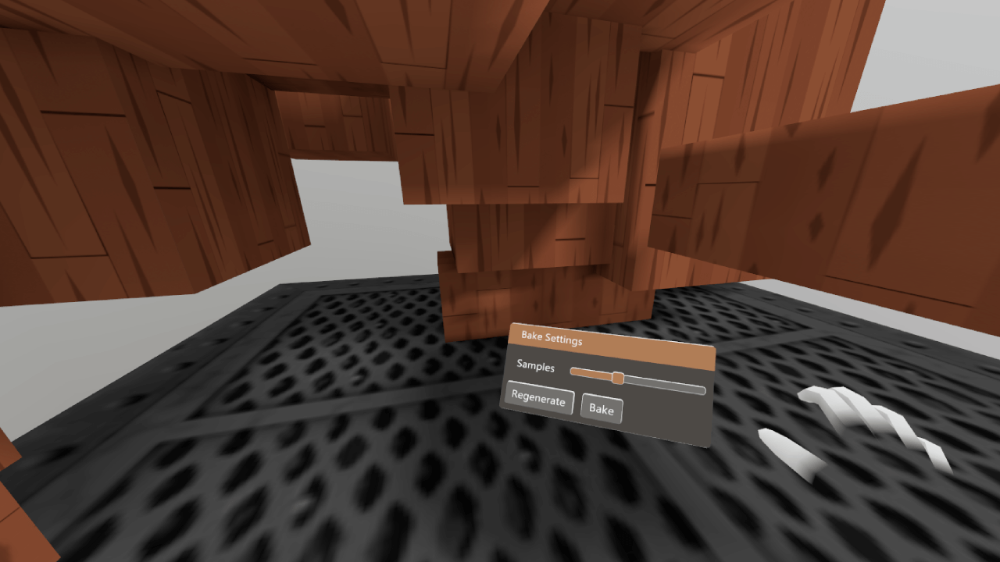

# Light Baking and Scene Management Demo

This is a quick demo for performantly managing static scenes, and baking lighting into them with StereoKit! This bakes lighting into the vertex colors of the mesh, so is visually limited by the number of vertices the mesh has, and will merge meshes together.

## [StaticScene.cs](StaticScene.cs)

This is a small class that will store `Model`s and `Mesh`es in a list, and draw them with the least amount of overhead. It also provides tools for raycasting on the scene, and managing 'draw only' and 'raycast only' elements.

This does not work with animated `Model`s.

## [BakedScene.cs](BakedScene.cs)

This class will take a `StaticScene`, as well as lighting information for the scene, grab the mesh data, bake vertex colors and combine the meshes together.

Baking involves casting rays throughout the environment for a single bounce of lighting. 0 samples will provide hard shadows and direct lighting, while more samples will improve the quality of lighting at the cost of quite a bit more time.

See the code for details on how to use it.

## License

This code is MIT licensed, feel free to use it in your own projects!